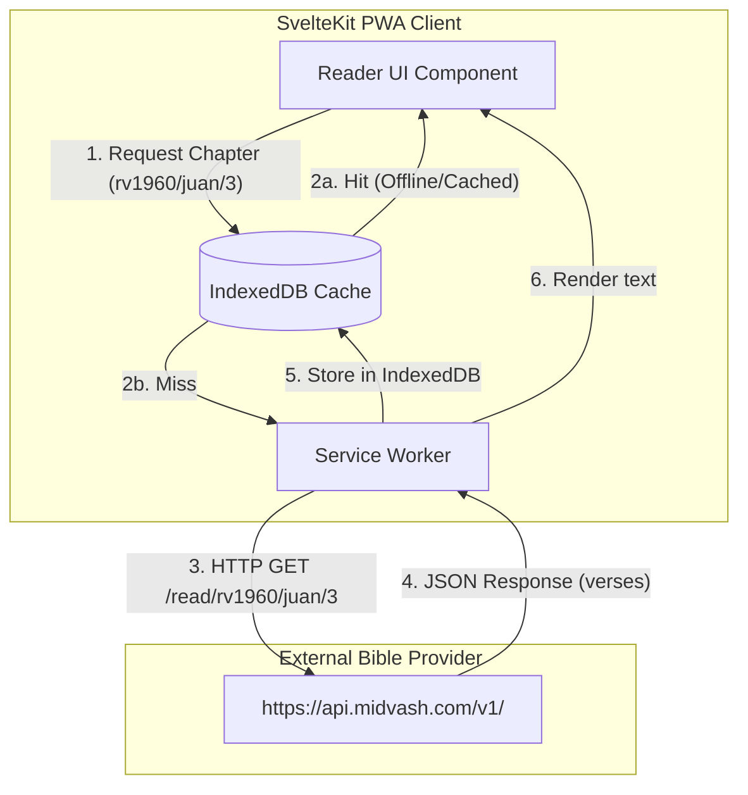
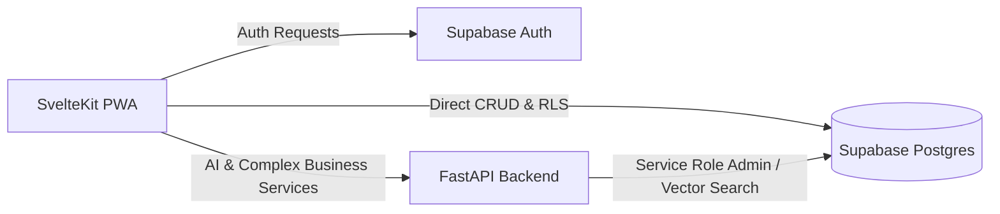
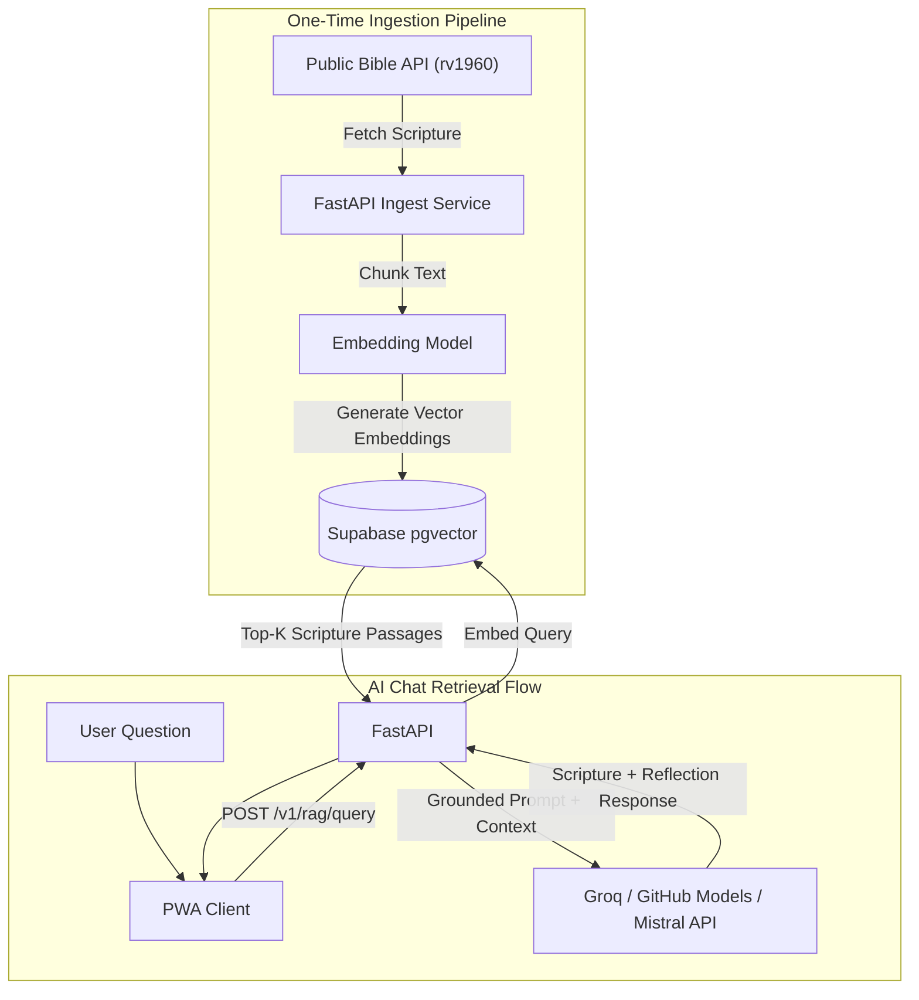

# Architecture Specification — Discipleship MVP

## Overview

This document defines the system architecture for the **Discipleship MVP** application based on **Option A (FastAPI + Supabase + Public Bible API)**. 

The primary design principle is the strict decoupling of **Application Backend Services** from the **Scripture Content Delivery**:
* **Application Backend (Supabase + FastAPI):** Manages user authentication, user profiles, prayer history, small group management, community feeds, reading plan progress, content moderation, and AI vector embeddings.
* **Scripture Content Delivery (Public Bible API):** Serves Bible books, chapters, and verses on-demand directly to the client PWA without routing through or bloating the Supabase Postgres database.
* **Offline Client Cache (IndexedDB):** Stores fetched Bible chapters locally in the client browser to satisfy offline reading requirements.

---

## Technologies and Stack

| Layer | Technology | Purpose & Rationale |
| :--- | :--- | :--- |
| **Frontend PWA** | SvelteKit + Service Worker | Mobile-first Progressive Web App (PWA). Provides offline capability, fast rendering, lightweight JS bundle, and local caching. |
| **Application Database** | Supabase Postgres | Primary store for app data: users, profiles, prayer requests, groups, reading plan progress, and AI vector embeddings. |
| **Application Auth** | Supabase Auth | Handles user registration and authentication (Email/Password). Guest mode allows Bible reading without session. |
| **Application Logic** | FastAPI (Python 3.11+) | Handles RAG pipeline, vector generation, moderation background jobs, Web Push notification scheduling, and complex business logic. |
| **Public Bible API** | `bible-api.deno.dev` | External REST API supplying Spanish Scripture text (`rv1960` translation). Supabase is **not** used as a Bible CDN. |
| **Offline Scripture Cache**| IndexedDB + Service Worker | Client-side persistent cache for Bible books/chapters fetched from the public API. |
| **Vector Store / RAG** | `pgvector` (in Supabase) | Stores embeddings and chunk metadata of Scripture (`rv1960`) and approved theological sources for grounding AI chat responses. |
| **File Storage** | Supabase Storage | Hosts user profile photos and optional media attachments. |
| **AI Models** | Groq Cloud / GitHub Models / Mistral AI + Local Embeddings | Cost-effective LLM chat completions using open-source models (via Groq Cloud, GitHub Models, or Mistral AI API); embeddings generated via `sentence-transformers` or HuggingFace models in FastAPI. |
| **Push Notifications** | Web Push (VAPID) | Sends scheduled Bible reading reminders from FastAPI via Service Worker. |

---

## Component/Folder Architecture

```text
discipulado/
├── docs/
│   ├── arquitectura.md       # Architectural specification
│   └── plan.md               # Product plan & tech stack evaluation
├── frontend/                 # SvelteKit PWA Application
│   ├── static/
│   │   ├── manifest.json     # Web App Manifest
│   │   └── sw.js             # Service Worker for offline asset & API caching
│   ├── src/
│   │   ├── lib/
│   │   │   ├── api/          # Public Bible API client & FastAPI backend client
│   │   │   │   ├── bible.ts  # Client for https://api.midvash.com/v1/
│   │   │   │   └── backend.ts# Client for FastAPI microservices
│   │   │   ├── db/           # IndexedDB implementation for Scripture storage
│   │   │   ├── components/   # UI components (Reader, PrayerCard, GroupFeed, Chat)
│   │   │   └── stores/       # Svelte state stores (auth, reader, offline status)
│   │   └── routes/           # App routes (/bible, /prayer, /groups, /ai, /profile)
│   ├── package.json
│   └── svelte.config.js
├── backend/                  # FastAPI Application Backend
│   ├── app/
│   │   ├── api/              # REST Endpoints (v1/rag, v1/plans, v1/moderation)
│   │   ├── core/             # Configuration, security, Supabase client initialization
│   │   ├── services/
│   │   │   ├── rag/          # Vector retrieval & LLM prompt execution
│   │   │   ├── bible_ingest/ # Pipeline to ingest rv1960 into pgvector
│   │   │   └── moderation/   # Content flagging & automated moderation logic
│   │   ├── models/           # Pydantic schemas & data models
│   │   └── main.py           # FastAPI entrypoint
│   ├── requirements.txt
│   └── Dockerfile
└── README.md
```

---

## Data Flow

### 1. Bible Reading Data Flow (Online & Offline)



* **Books list endpoint:** `https://api.midvash.com/v1/books?language=es&version=rvr1960`
* **Reading endpoint example:** `https://api.midvash.com/v1/rvr1960/john/3/16`

### 2. Application State & Business Logic Flow



### 3. AI RAG & Ingestion Data Flow



---

## Key Technical Decisions

1. **Decoupled Scripture Provider:** Supabase Postgres remains lean by excluding the full Bible text (~31,000 verses). Scripture reading relies entirely on `https://api.midvash.com/es#endpoints` and IndexedDB client caching.
2. **Translation Consistency (`rv1960`):** The external reader API, the offline cache, the local keyword search, and the AI RAG ingestion pipeline all strictly share the exact same translation: **Reina-Valera 1960 (`rv1960`)**.
3. **Offline-First PWA Cache:** IndexedDB stores fetched Bible chapters persistently. Subsequent readings work fully offline without hitting either the external API or Supabase.
4. **Security & Authorization Boundaries:** Client-side CRUD operations (prayers, community posts, group messages) are enforced by Supabase Row Level Security (RLS) policies. FastAPI uses Supabase service roles for vector retrieval and admin tasks.
5. **AI Guardrails (Non-Invention):** AI responses are constructed strictly through RAG against stored `pgvector` chunks. If retrieval similarity is below threshold, the AI defaults to a fallback response instead of inventing theological content.
