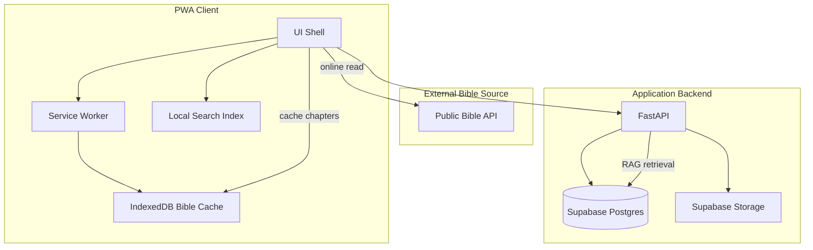
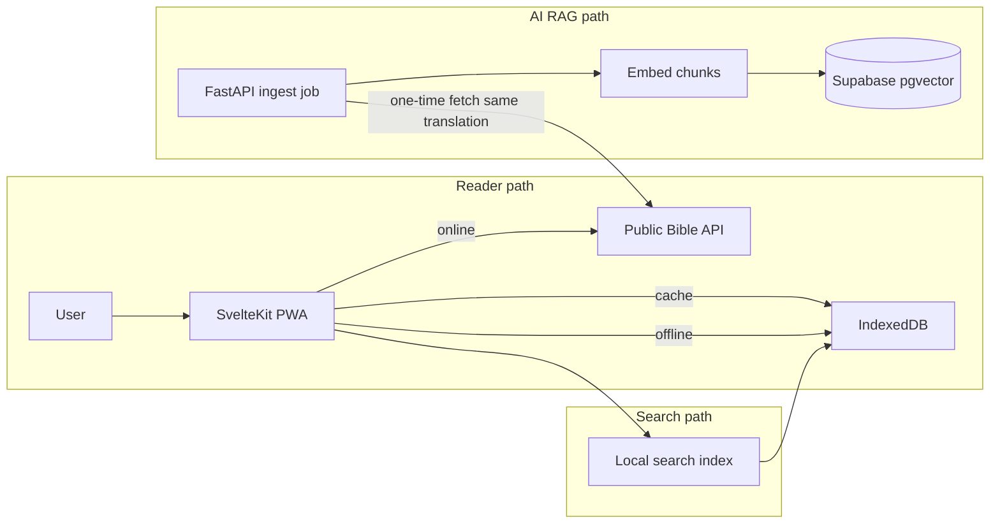

# Tech Stack Options — Discipleship MVP

Source: [`_plan.md`](_plan.md) (project root).

Your constraints: **Python background**, **minimal cost**, **solo founder**, **Spanish-first PWA** with offline Bible, RAG-based AI, community, and small groups.

**Option A design principle:** Supabase + FastAPI together form the **application backend**. Bible text for reading comes from a **public Bible API** — not from Supabase.

---

## What the stack must support

From the plan, these are the hard technical requirements:

| Area | Requirement |
|------|-------------|
| PWA | Installable, mobile-first, offline Bible reading |
| Bible | One Spanish translation, keyword search, reading plans |
| AI | Retrieval-first (Scripture + approved sources), chat, personalization — not free-form theological invention |
| Prayer | Guided prayers, private requests, searchable history, reviewer access |
| Community | Text feed, reactions/comments, AI auto-hide + human moderation queue |
| Groups | Public discovery, join requests, leader/admin approval flows |
| Auth | Email/password; guest Bible-only mode |
| Data | Full cascade delete on account deletion |
| Notifications | Bible reminders only (Web Push) |
| Analytics | Product + spiritual-use metrics (not engagement-maximizing) |

Note: In **Option A**, Supabase holds app data (users, prayer, community, reading-plan progress, AI embeddings) — **not** the primary Bible text store for the reader UI.

---

## Option A — FastAPI + Supabase + SvelteKit PWA (Recommended)

**Best balance of Python-first backend, low cost, and solo-founder velocity.**

### Application backend vs Bible source

| Role | Technology | Responsibility |
|------|------------|----------------|
| **Application backend** | Supabase + FastAPI | Auth, user profiles, prayer, community, groups, reading-plan progress, moderation, file storage, AI embeddings |
| **Bible source (reading)** | Public Bible API | Fetch books/chapters/verses when online — Supabase is **not** the Bible CDN |
| **Bible source (offline)** | IndexedDB + service worker | Cache chapters fetched from the public API |
| **Bible source (search + RAG)** | Local index + pgvector ingest | One-time pipeline from the **same translation** as the public API |

**Key assumption:** Supabase stores **application state**, not the primary Bible text for the reader UI.

### Stack

| Layer | Choice | Why |
|-------|--------|-----|
| Frontend | **SvelteKit** PWA | Lightweight, excellent PWA/offline story, fast to build; smaller bundle than React for mobile |
| App backend (data + auth) | **Supabase** (Postgres, Auth, Storage) | Managed application backend — users, prayer, community, groups, plan progress, moderation |
| App backend (logic) | **FastAPI** | Python services: RAG, moderation jobs, reading-plan logic, Web Push, Bible ingest for embeddings |
| Auth | **Supabase Auth** (email/password) | Email/password only; guest mode = no session, Bible routes public |
| Bible reading (online) | **Public Bible API** (`bible-api.deno.dev`) | Fetch books/chapters/verses on demand (`https://bible-api.deno.dev/api/read/rv1960/juan/3/16`); Supabase is not used for verse text |
| Bible reading (offline) | **IndexedDB + service worker cache** | Cache chapters fetched from public API; satisfies MVP offline requirement without Supabase as Bible store |
| Bible keyword search | **Client-side search index** (built from cached/API-fetched text) or **FastAPI proxy + local index** | Public APIs rarely offer full-text search; build a one-time index from the same translation, search locally or via thin FastAPI endpoint — **not** Postgres FTS on Supabase for MVP |
| Vector/RAG | **pgvector** in Supabase + **FastAPI RAG service** | Store **embeddings + chunk metadata** for Scripture and approved theological sources; one-time ingest from same translation as public API |
| File storage | **Supabase Storage** | Profile photos; free tier sufficient for MVP |
| AI models | **Groq Cloud / GitHub Models / Mistral AI** (Open-source LLMs) + **local embeddings** (`sentence-transformers` / HuggingFace API) | Cost-effective open-source LLM inference; embeddings computed once on ingest |
| Push notifications | **Web Push** (VAPID) via FastAPI + service worker | Bible reminders only |
| Hosting | **Cloudflare Pages** (frontend, free) + **Fly.io / Render free tier** (FastAPI) + **Supabase** (free) | ~$0–20/mo unless AI usage spikes |

### Bible data flow (Option A)

1. **Online reading:** PWA calls public Bible API → renders chapter → caches in IndexedDB.
2. **Offline reading:** PWA reads from IndexedDB/service worker; no Supabase round-trip for verse text.
3. **Keyword search:** Search runs against a **local or FastAPI-hosted index** built from the same translation — not live API queries per search.
4. **AI retrieval:** FastAPI **ingests once** from the public API (or equivalent source file), chunks, embeds, stores in pgvector. AI never invents verses from model memory.

### What lives in Supabase vs what does not

| In Supabase | Not in Supabase (Option A) |
|-------------|----------------------------|
| User accounts, profiles, auth | Full Bible text as primary reader store |
| Prayer history, guided prayer metadata | Live Bible API responses (ephemeral unless cached client-side) |
| Community posts, comments, reactions | |
| Small groups, memberships, approvals | |
| Reading-plan definitions + **user progress** | |
| Moderation queue, reports | |
| Scripture + source **embeddings** (pgvector) for RAG | |
| Approved theological source documents | |
| Profile photos (Storage) | |

### Pros

- You write most logic in **Python** (RAG ingest, moderation, reading-plan adaptation).
- **Supabase free tier** covers auth, app DB, and storage — no Bible hosting cost or DB bloat from full text.
- **Public Bible API** avoids maintaining/hosting Scripture text; you consume a maintained upstream source.
- **pgvector** in Supabase handles AI retrieval only (embeddings + metadata), keeping the DB lean.
- Clear separation: external API for reading, Supabase for app state, client cache for offline.

### Cons

- **Two runtimes**: SvelteKit (JS) for PWA + FastAPI (Python) for app API — unavoidable for a good offline PWA.
- **Three Bible touchpoints** to keep in sync: public API (read), client cache (offline), ingest pipeline (search + RAG) — all must use the **same translation**.
- Public Bible API **dependency**: rate limits, downtime, licensing — mitigated by aggressive client caching and one-time ingest for search/RAG.
- Must **validate API license** for app use, caching, and offline redistribution (even PD text can have API ToS constraints).
- Supabase free tier limits (~500 MB DB) — fine for MVP since full Bible text is not stored there; embeddings + app data only.

### Selected Bible API — `bible-api.deno.dev`

* **Books list:** `https://bible-api.deno.dev/api/books`
* **Read chapter/verse (RV1960):** `https://bible-api.deno.dev/api/read/rv1960/juan/3/16`
* **Documentation & Examples:** `https://docs-bible-api.netlify.app/api/examples`

Provides Spanish Reina-Valera 1960 (RV1960) text directly over JSON. PWA client caches fetched chapters into IndexedDB for offline reading, and FastAPI runs an ingestion job against this API to seed vector embeddings for RAG.

### Fit for plan phases

- **Phase 1:** Public Bible API integration, guest reading, IndexedDB offline cache, local keyword search index, auth via Supabase.
- **Phase 2:** Reading plans + progress in Supabase; prayer features in Supabase.
- **Phase 3:** One-time Scripture ingest → pgvector; RAG chat via FastAPI; approved source library in Supabase.
- **Phase 4:** Community + groups in Supabase; FastAPI moderation jobs.

---

## Option B — FastAPI monolith + self-hosted VPS (Maximum control, lowest recurring cost)

**Best if you want one bill (~€4–5/mo) and full ownership of data.**

### Stack

| Layer | Choice | Why |
|-------|--------|-----|
| Frontend | **SvelteKit** or **Vue + Vite** PWA | Same PWA rationale as Option A |
| Backend | **FastAPI** (API + admin + RAG + Web Push) | Single Python codebase |
| Database | **PostgreSQL** on VPS | Full control; pgvector extension |
| Auth | **FastAPI Users** or custom JWT + **passlib/bcrypt** | No vendor lock-in; email/password only matches plan |
| Bible keyword search | **Meilisearch** (self-hosted on same VPS) | Better Spanish typo tolerance and relevance than raw Postgres FTS |
| Vector/RAG | **pgvector** or **Qdrant** (self-hosted) | Qdrant is stronger at scale; pgvector simpler ops |
| Object storage | **MinIO** (S3-compatible, self-hosted) | Profile photos |
| Reverse proxy | **Caddy** or **Nginx** | TLS, routing |
| AI models | Same as A: API for chat, local embeddings | |
| Hosting | **Hetzner CX22** (~€4/mo) or similar | Everything on one box |

### Pros

- **Lowest long-term cost** once running.
- No vendor pause/limits on free tiers.
- Meilisearch gives noticeably better Bible keyword search.
- All prayer/community data stays on your machine — aligns with sensitive prayer history requirements.

### Cons

- **You are DevOps**: backups, TLS, updates, monitoring, scaling.
- Solo-founder time sink during incidents.
- No managed auth — you must implement securely (password reset, rate limiting, etc.).

### When to choose this

Choose B if you are comfortable maintaining a Linux VPS and want to avoid Supabase/Vercel dependency — not if you want fastest path to first users.

---

## Option C — Django + DRF + SvelteKit PWA (Batteries-included admin)

**Best if moderation, theological source curation, and reviewer workflows matter early.**

### Stack

| Layer | Choice | Why |
|-------|--------|-----|
| Frontend | **SvelteKit** PWA | Same as above |
| Backend | **Django + Django REST Framework** | Built-in admin UI is a huge solo-founder win |
| Database | **PostgreSQL** (Supabase free or VPS) | |
| Auth | **Django auth** or **django-allauth** (email only) | Mature, well-documented |
| Vector/RAG | **pgvector** + Django management commands to ingest Scripture/sources | Batch ingestion fits Django commands |
| Bible search | Postgres FTS or **django-haystack + Meilisearch** | |
| Async jobs | **Celery + Redis** (or Django-Q) | Moderation queue, embedding jobs, reminder scheduling |
| Admin | **Django Admin** (customized) | Theological source approval, moderation review, group approval, reviewer prayer access audit |

### Pros

- **Django Admin** maps directly to plan needs: approve groups, review reported content, manage approved theological sources, assign group leaders.
- Strong ORM and migrations for complex domain (reading plans, groups, prayer history immutability rules).
- Mature ecosystem for permissions (reviewer roles, leader vs admin).

### Cons

- Heavier framework than FastAPI — more boilerplate for a pure API.
- Celery/Redis adds ops (or use Django-Q with DB backend to reduce infra).
- Slightly slower iteration for small JSON APIs vs FastAPI.

### When to choose this

Choose C if you expect to spend significant time in **admin/moderation/theological curation UIs** during MVP — the plan emphasizes human-in-the-loop moderation and approved source libraries.

---

## Option D — Supabase-first full-stack (Minimal backend code)

**Best if you want to minimize Python backend surface and move fast with SQL + edge functions.**

### Stack

| Layer | Choice | Why |
|-------|--------|-----|
| Frontend | **SvelteKit** or **Next.js** PWA | |
| Backend logic | **Supabase Edge Functions** (TypeScript/Deno) + thin **FastAPI** only for RAG | Most CRUD via Supabase client + RLS policies |
| Database | **Supabase Postgres** + pgvector | |
| Auth | **Supabase Auth** | |
| Bible search | Postgres FTS or **Supabase full-text** | |
| AI/RAG | **FastAPI microservice** (Python) called from Edge Functions | Keeps RAG in Python where you are strongest |
| Storage | Supabase Storage | |

### Pros

- Very fast CRUD: community posts, comments, groups, reading progress via SQL + RLS.
- Guest Bible mode via public API (same pattern as Option A) or public read routes — not Bible tables in Supabase.
- Lowest amount of custom backend for non-AI features.

### Cons

- Significant logic in **TypeScript Edge Functions** — fights your Python preference.
- Complex RLS for groups/moderation/reviewer prayer access can become hard to debug.
- Edge Function cold starts and Deno ecosystem less familiar if you are Python-first.

### When to choose this

Choose D only if you are willing to write substantial **TypeScript** for backend rules — otherwise A or C fit better.

---

## Cross-cutting decisions (same across all options)

### Offline Bible (required for all)

**Option A (public Bible API):**

- **Online:** fetch books/chapters/verses from public Bible API.
- **Offline:** cache fetched chapters in **IndexedDB** via service worker; read from cache when offline.
- **Search:** build a **local search index** from the same translation (populated as user reads, or via one-time background fetch) — do not query the public API per search.
- **RAG ingest:** FastAPI one-time job fetches/embeds the same translation into Supabase pgvector.
- **Supabase:** stores reading-plan progress and spiritual-use analytics — not raw verse text for the reader.

**Options B, C, D (alternative approaches):**

- May ship Bible text as versioned static JSON/SQLite bundled or fetched once.
- Service worker caches Bible assets; IndexedDB stores reading position and offline state.
- API sync when online for plans/progress — not for raw Bible text after initial cache.

### RAG architecture (plan §6–7)

Shared pattern regardless of option:

1. **Ingestion pipeline** (Python): fetch Scripture from public API (Option A) or static source (B/C/D) + approved commentary chunks → embed → store in vector DB.
2. **Retrieval**: user question → embed → top-k passages + sources.
3. **Generation**: LLM prompt with strict template: Scripture → Reflection → Practical Action; cite retrieved sources only.
4. **Fallback**: return "No sé" when retrieval confidence is low — never invent verses.

Recommended libraries: **LangChain** or **LlamaIndex** (Python), or a thin custom layer over pgvector if you want fewer dependencies.

### AI cost control (minimal budget)

- Use **small/cheap chat model** for most turns; reserve larger model for complex pastoral questions.
- **Pre-compute embeddings** for Bible and sources (one-time + on source approval).
- Cache frequent retrieval results per topic cluster.
- Rate-limit AI chat per user on free tier.

### Moderation workflow (plan §10)

- On report or AI flag: set `content.status = hidden_pending_review` (soft hide).
- Background job notifies moderator (email or admin queue).
- Human action: `restore` or `delete_permanent` — AI never hard-deletes.

### Account deletion (plan §16)

- Single **cascade delete** transaction or ordered deletes: posts, comments, reactions, prayer history, profile, auth user.
- Implement as one backend endpoint with audit log (optional, not retained user content).

### Donations (plan §20)

- **Stripe Checkout** (donation mode) or **PayPal Donate** — no subscription logic in MVP.

### Analytics (plan §19)

- **Plausible** or **Umami** (self-hosted, privacy-friendly) for product metrics.
- Spiritual-use metrics (Bible chapters read, plan progress) stored in **your Postgres** — not Mixpanel-style engagement funnels.

---

## Comparison summary

| Criterion | A: FastAPI + Supabase + SvelteKit | B: Self-hosted VPS | C: Django + SvelteKit | D: Supabase-first |
|-----------|-------------------------------------|--------------------|-----------------------|-------------------|
| Python focus | High | Highest | High | Medium (TS edge) |
| Monthly cost | ~$0–20 | ~€4–5 + AI API | ~$0–20 | ~$0–15 |
| Solo-founder speed | Fast | Slow (ops) | Fast for admin | Fast for CRUD |
| Offline PWA | Strong (API + client cache) | Strong | Strong | Strong |
| Bible text hosting | **None — public API** | Self-hosted | Self-hosted or API | Supabase or API |
| Bible search quality | Good (local index) | Best (Meilisearch) | Good–Best | Good |
| Moderation/admin UX | Build custom | Build custom | **Django Admin** | Supabase dashboard + custom |
| DevOps burden | Low | **High** | Low–Medium | Low |
| Vendor lock-in | Medium (Supabase + Bible API) | Low | Medium | **High** |

---

## Recommendation for your profile

Given **Python + minimal cost + solo founder**:

**Primary recommendation: Option A** (FastAPI + Supabase + SvelteKit PWA)

- You stay in Python for the hard parts (RAG ingest, moderation logic, reading-plan adaptation).
- **Supabase** handles auth, app data, storage, and AI vectors — **not** Bible text hosting.
- **Public Bible API** supplies Scripture for reading; client cache enables offline; one-time ingest powers search and RAG.
- SvelteKit is the smallest frontend investment for a solid PWA.

**Strong alternative: Option C** (Django + SvelteKit) if you want the **theological source library, moderation queue, group approval, and reviewer tools** in a usable admin UI within weeks — the plan has many human-in-the-loop workflows that Django Admin accelerates.

**Avoid for MVP:** Option B unless you already run VPS infrastructure; Option D unless you want to pivot toward TypeScript backend.

---

## Suggested next step (after you pick an option)

1. Confirm option (A or C recommended).
2. Define repo layout: `frontend/` (SvelteKit PWA) + `backend/` (FastAPI or Django).
3. **Option A:** Select public Bible API + Spanish PD translation; verify license for caching/offline; define cache, local search-index, and RAG-ingest strategy for the same translation.
4. Scaffold Phase 1 only: auth, guest Bible via public API, offline cache, local keyword search — before AI or community.
